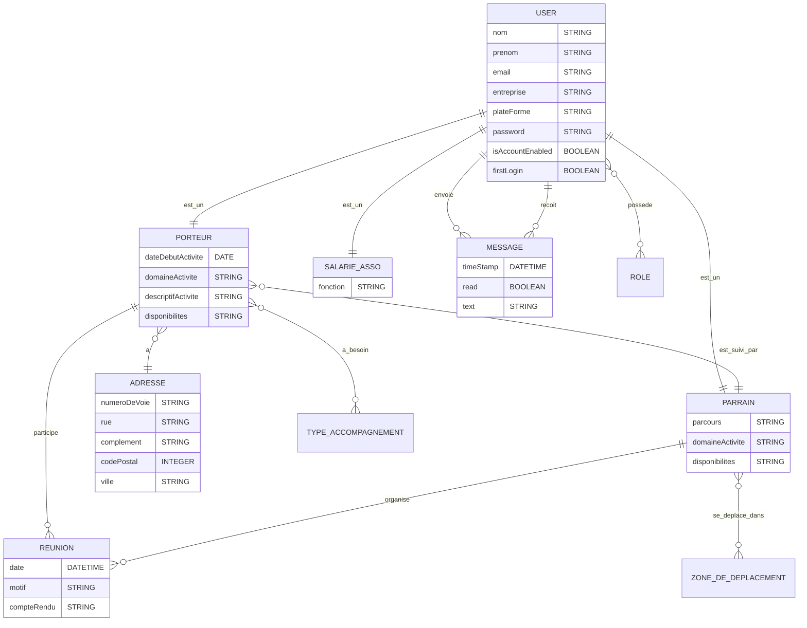

```mermaid
erDiagram

    USER ||--|| PORTEUR : est_un
    USER ||--|| PARRAIN : est_un
    USER ||--|| SALARIE_ASSO : est_un
    USER ||--o{ MESSAGE : envoie
    USER ||--o{ MESSAGE : recoit
    USER }o--o{ ROLE : possede

    PORTEUR }o--|| ADRESSE : a
    PORTEUR }o--o{ TYPE_ACCOMPAGNEMENT : a_besoin
    PORTEUR }o--|| PARRAIN : est_suivi_par
    PORTEUR ||--o{ REUNION : participe

    PARRAIN ||--o{ REUNION : organise
    PARRAIN }o--o{ ZONE_DE_DEPLACEMENT : se_deplace_dans

    ADRESSE {
        numeroDeVoie STRING
        rue STRING
        complement STRING
        codePostal INTEGER
        ville STRING
    }

    MESSAGE {
        timeStamp DATETIME
        read BOOLEAN
        text STRING
    }

    REUNION {
        date DATETIME
        motif STRING
        compteRendu STRING
    }

    USER {
        nom STRING
        prenom STRING
        email STRING
        entreprise STRING
        plateForme STRING
        password STRING
        isAccountEnabled BOOLEAN
        firstLogin BOOLEAN
    }

    PARRAIN {
        parcours STRING
        domaineActivite STRING
        disponibilites STRING
    }

    PORTEUR {
        dateDebutActivite DATE
        domaineActivite STRING
        descriptifActivite STRING
        disponibilites STRING
    }

    SALARIE_ASSO {
        fonction STRING
    }

```