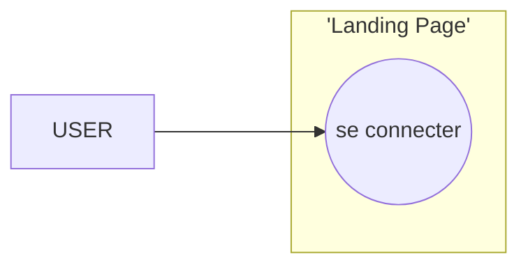
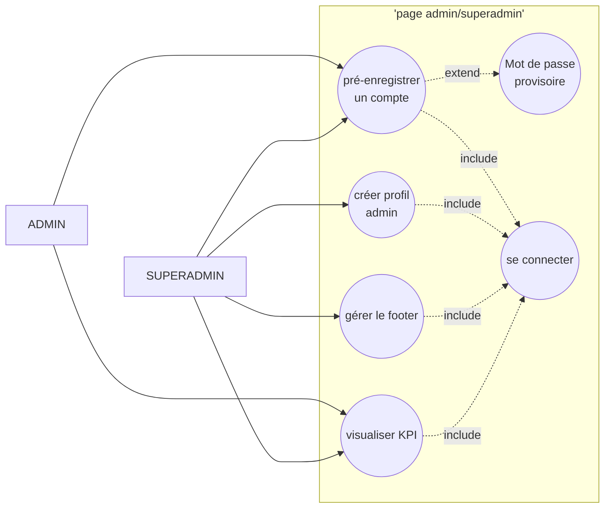
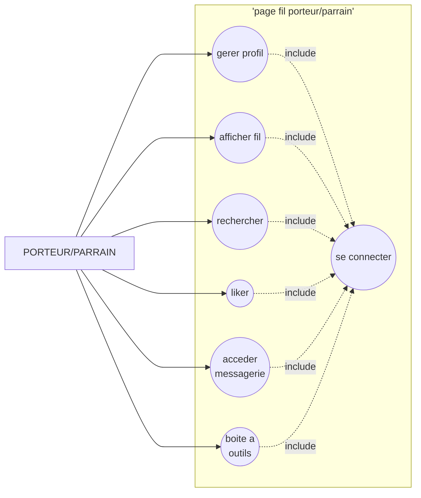
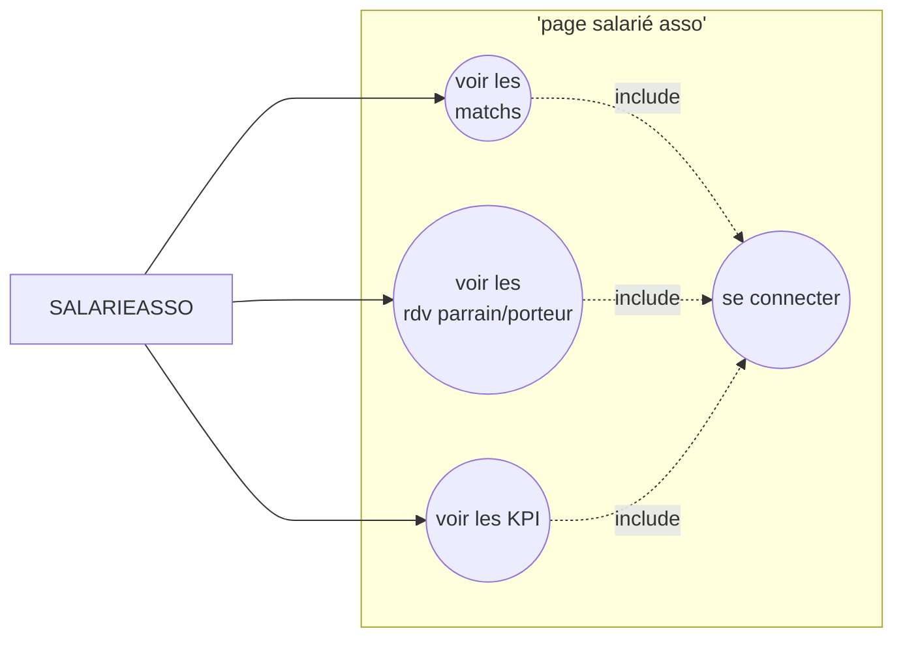

```mermaid
flowchart LR
    subgraph 'Landing Page'
    uc1((se connecter))
    end
    
    USER--->uc1

    
```
---

```mermaid
flowchart LR
subgraph 'page admin/superadmin'
    uc1((pré-enregistrer
     un compte))
    uc2((Mot de passe
     provisoire))
     uc3((se connecter))
     uc4((créer profil
     admin))
     uc5((gérer le footer))
     uc6((visualiser KPI))
     
    end
    
    ADMIN --->uc1
    ADMIN ---->uc6
    uc1 -.include.->uc3
    uc4 -.include.->uc3
    uc5 -.include.->uc3
    uc6 -.include.->uc3
    
    uc1 -.extend.->uc2
    
    SUPERADMIN --->uc1
    SUPERADMIN --->uc4
    SUPERADMIN --->uc5
    SUPERADMIN --->uc6
```
---

```mermaid
flowchart LR
subgraph 'page fil porteur/parrain'
    uc6((se connecter))
    uc1((gerer profil))
    uc2((afficher fil))
    uc3((rechercher))
    uc4((liker))
    uc5((acceder
    messagerie))
    uc7(( boite a
    outils))
    end

PORTEUR/PARRAIN --->uc1
PORTEUR/PARRAIN --->uc2
PORTEUR/PARRAIN --->uc3
PORTEUR/PARRAIN --->uc4
PORTEUR/PARRAIN --->uc5
PORTEUR/PARRAIN --->uc7
    uc1 -.include.->uc6
    uc2 -.include.->uc6
    uc3 -.include.->uc6
    uc4 -.include.->uc6
    uc5 -.include.->uc6
    uc7 -.include.->uc6
```
---

```mermaid
flowchart LR
subgraph 'page salarié asso'
    uc1((voir les
    matchs))
    uc2((voir les
    rdv parrain/porteur))
    uc3((voir les KPI))
    uc4((se connecter))
    end
    
    SALARIEASSO --->uc1
    SALARIEASSO --->uc2
    SALARIEASSO --->uc3
    uc1 -.include.->uc4
    uc2 -.include.->uc4
    uc3 -.include.->uc4
```